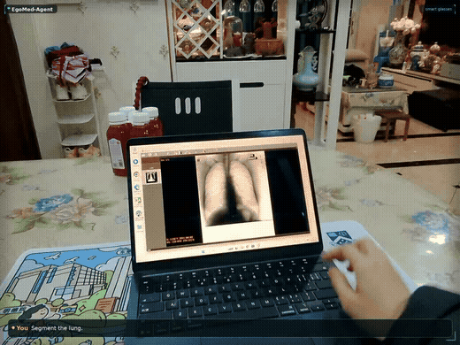

# EgoMed-Agent — Interactive Egocentric Medical Image Segmentation (IEMIS)

> Code for the paper *“Understanding From Human Perspective: A Multi-agent System for Interactive Egocentric Medical Image Segmentation”*.
> Built on Meta FAIR's [SAM 2](https://github.com/facebookresearch/sam2) (Apache-2.0; see Acknowledgments).
> Paper section / table ↔ script mapping: [`PAPER_TO_CODE.md`](PAPER_TO_CODE.md).

## Demo



A clinician wearing smart glasses says, from a first-person view, **"Segment the lung."** The view contains two lungs, so the system **asks back** — *left or right?* — the clinician answers **"The left one."**, and once the target is confirmed the system **segments the left lung and tracks it across frames**.

## Method

EgoMed-Agent is a multi-agent system in which three agents cooperate for interactive egocentric medical image segmentation:

- **Detection Agent** (YOLO26) — detects candidate medical targets frame by frame;
- **Confirmation Agent** (DeepSeek) — grounds the instruction against the candidates with a reliability score, confirming when the grounding is reliable and asking the user to clarify when it is not;
- **Propagation Agent** (SAM 2) — propagates the segmentation mask, and when the detection box and the propagated box diverge below a threshold τ₂ it re-initializes propagation from the current detection (IoU-gated correction), keeping the mask on the target across frames.

These realize the paper's two workflows: the **Target Confirmation Workflow** (confirm the user-intended target) and the **Localization-Guided Propagation Workflow** (segment stably across the egocentric video).

## Repository layout

| Path | Contents |
|---|---|
| `scripts/egomed_agent/` | Main system `egomed-agent-iou06.py` (τ₂=0.6) + `tau2_ablation/` (τ₂ = 0 / 0.3 / 0.9) |
| `scripts/detection_agent/` | Detection Agent: image-type classifier + 5 per-modality detectors (train / eval) |
| `scripts/confirmation_agent/` | Confirmation Agent (DeepSeek) + Target Confirmation evaluation (GSA / TCA, Table III) |
| `scripts/baselines/` | Comparison methods (text-prompt baselines) + module ablations (Init-Only / Frame-wise) + nnU-Net upper bound |
| `sam2/` `configs/` `tools/` `training/` | Upstream SAM 2 code |
| `comparison_methods/` | Notes and patches for the external repos the baselines require (see its README) |

## Setup

```bash
conda env create -f environment.yml && conda activate sam2   # python 3.12, torch 2.8
pip install -e .                                             # install the bundled sam2 package
bash checkpoints/download_ckpts.sh                           # download SAM 2 checkpoints
```

The **Confirmation Agent** calls DeepSeek through its OpenAI-compatible API: copy `.env.example` to `.env` and fill in your key (default model `deepseek-v4-flash`).

## Path configuration

Scripts resolve the repository root automatically, so they run from any clone. Put the dataset under `<repo>/data/` and the SAM 2 checkpoints under `<repo>/checkpoints/`; to store them elsewhere, override with the environment variables `EGOMED_ROOT` / `EGOMED_EXT_ROOT` (see [`REPRODUCE.md`](REPRODUCE.md)).

## Running

```bash
python scripts/egomed_agent/egomed-agent-iou06.py     # main result, τ₂ = 0.6
```

- τ₂ hyper-parameter ablation: `scripts/egomed_agent/tau2_ablation/egomed-agent-iou{0,03,09}.py`;
- requires the per-modality YOLO26 detector weights (trained by `scripts/detection_agent/train_*`, placed under `<repo>/runs/yolo26_det/...`);
- outputs: `<repo>/runs/eval_.../` (predicted masks, overlays, per-case/class Dice, correction logs).

Scripts have no argparse — edit the config block at the top of each file (`CUDA_VISIBLE_DEVICES` / `DATASETS` / `TRACK_IOU_THRES`, etc.).

## Evaluation & baselines

- **Text-prompt baselines**: `eval_grounded_sam2_*` · `eval_langsam_*` · `eval_medsam3_*` · `eval_sam3_*`;
- **Module ablations**: `eval_baseline1.py` (Init-Only Prop.) · `eval_baseline2.py` (Frame-wise Det.);
- **nnU-Net upper bound**: `eval_nnunet_egomed5_test_dice.py`;
- **Target Confirmation** (GSA / TCA, Table III): `scripts/confirmation_agent/`.

> Running the comparison baselines requires cloning the corresponding external repos (SAM3 / MedSAM3 / Grounded-SAM-2 / LangSAM) under `EGOMED_EXT_ROOT`; see [`comparison_methods/README.md`](comparison_methods/README.md).

## Training

- **Detection Agent** (`scripts/detection_agent/`): `train_yolo26_egomed5_all.py` (5 per-modality detectors) · `train_tool_selection_yolo26_cls.py` (image-type classifier);
- **nnU-Net upper bound**: `scripts/baselines/train_nnunet_egomed5.py`.

## Dataset

523 videos / 173,657 frames / **5 modalities** (CT · MRI · ultrasound · X-ray · endoscopy) / 12 targets / 5 scenes. Released through the [Hugging Face dataset repository](https://huggingface.co/datasets/daizywang/EgoMed-IEMIS); the collection protocol is provided in the paper's supplementary material.

## Results

On the multi-modality benchmark, EgoMed-Agent reaches **71.34% average Dice**, well above the best text-prompted baseline (11.70%). See Tables II / III in the paper.

## License & acknowledgments

Released under the **Apache License 2.0** (see [`LICENSE`](LICENSE) / [`NOTICE`](NOTICE)). Built on Meta FAIR's [SAM 2](https://github.com/facebookresearch/sam2) (Apache-2.0); the `sam2/`, `tools/`, `training/`, and `configs/` directories are retained from upstream.
