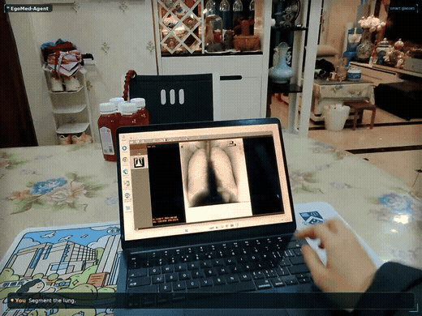

# EgoMed-Agent — Interactive Egocentric Medical Image Segmentation (IEMIS)

> Code for the paper [*“Understanding From Human Perspective: A Multi-agent System for Interactive Egocentric Medical Image Segmentation”*](https://arxiv.org/abs/2607.17341).

---

## 本阶段实时链路：快速开始（中文速查）

> 在论文复现的基础上，本仓库另做了一套**实时采集 → 分割回显**链路：用**手机 / 摄像头当"眼镜"**指向屏幕上的医学影像，
> 医生说话定目标 → 服务端逐帧推理 → 客户端实时回显分割结果（面向"辅助阅片"场景，机位固定）。
> **论文原版复现说明（Method / Setup / Baselines / Training 等）见本文档下方。**

### 想做什么 → 怎么做

| 想做什么 | 怎么做 |
|---------|--------|
| **一键演示**（推荐） | 双击 **`启动模拟眼镜.bat`**（自动：起服务端真引擎 → 等预热 → 打开示例影像 → 起客户端） |
| 首次安装环境 | 双击 **`安装环境.bat`**（建 conda 环境 `egomed` → 装依赖 → 下载模型权重） |
| 用手机当"眼镜镜头" | `启动模拟眼镜.bat --source url --input http://<手机IP>:8080/video` |
| 自测设备 | `python client\live_client.py --probe`（摄像头）/ `--mic-selftest 3`（麦克风） |
| 一键验收 | `python client\acceptance_test.py --suite mock`（假实现）/ `--suite real`（真引擎，需服务端在跑） |
| 量化评估 | `client\eval_segmentation.py`（精度）/ `eval_latency.py`（延迟）/ `eval_asr.py`（语音） |
| 合成演示视频 | `python client\make_demo_video.py`（真实链路 + HUD + 坏帧防抖段） |

> **解释器解析顺序**（`启动模拟眼镜.bat` 内）：环境变量 `EGOMED_PY` → 常见 conda 路径 → PATH 中的 `python`；
> 不再写死某一台机器的绝对路径（换机器无需改脚本）。

### 文档索引

| 文档 | 作用 |
|------|------|
| `docs/API_CONTRACT.md` | **接口契约 v1.0.3（冻结）**：字段 / HTTP 路径 / 错误码 / 生命周期 |
| `docs/端到端流程设计.md` | 眼镜 → 服务器三层架构、数据流、模拟策略与迁移路径 |
| `docs/复现报告.md` | **论文实验复现结论**（L0~L4 分级、环境与权重实测、评测协议、ACDC 实测指标、缺口与补跑清单） |
| `docs/总计划.md` | **任务与进度**（N1~N18）+ 子计划索引 |
| `docs/决策记录.md` | 设计决策 D1~D14（含理由、代价、重新评估条件） |
| `docs/失败案例分析.md` | 7 例失败（现象 → 根因 → 对策 → 现状） |
| `docs/指标_分割精度_在线vs离线.md` | 精度量化方法（Dice/IoU，在线 vs 离线） |
| `docs/工作日志.md` · `docs/PROGRESS.md` | 断点记录 / 成果大事记 |

### 当前能力与边界（一句话）

- **能做**：5 模态 24 个目标的实时分割回显｜语音切目标｜跨模态歧义主动澄清｜遮挡/坏帧防抖（保留上一帧、提示、自动恢复）｜断流自动重连｜一键验收（假实现 8/8、真引擎 11/11）。
- **指标**：端到端延迟 **P95 ≈ 0.5 s**、结果刷新 **2~3 fps**、语音字准率 **86.6%**（52 句）。
- **暂不支持**：AR 世界锚定（掩膜"跟手"）、一次分割多个器官、临床级精度（心肌 Dice ≈0.40）、多人并发与权限审计、患者数据管理。
- **依赖**：真引擎需 NVIDIA GPU（开发机为 RTX 5060），启动预热约 80 秒；仅有公开数据集（ACDC / CAMUS / Amos / Montgomery / PolypGen）。

---

## Demo



A clinician wearing smart glasses says, from a first-person view, **"Segment the lung."** The view contains two lungs, so the system **asks back** — *left or right?* — the clinician answers **"The left one."**, and once the target is confirmed the system **segments the left lung and tracks it across frames**.

## Method

EgoMed-Agent is a multi-agent system in which three agents cooperate for interactive egocentric medical image segmentation:

- **Detection Agent** — detects candidate medical targets frame by frame;
- **Confirmation Agent** — grounds the instruction against the candidates with a reliability score, confirming when the grounding is reliable and asking the user to clarify when it is not;
- **Propagation Agent** — propagates the segmentation mask, and when the detection box and the propagated box diverge below a threshold τ₂ it re-initializes propagation from the current detection (IoU-gated correction), keeping the mask on the target across frames.

These realize the paper's two workflows: the **Target Confirmation Workflow** (confirm the user-intended target) and the **Localization-Guided Propagation Workflow** (segment stably across the egocentric video).

## Repository layout

| Path | Contents |
|---|---|
| `scripts/egomed_agent/` | Main system `egomed-agent-iou06.py` (τ₂=0.6) + `tau2_ablation/` (τ₂ = 0 / 0.3 / 0.9) |
| `scripts/detection_agent/` | Detection Agent: image-type classifier + 5 per-modality detectors (train / eval) |
| `scripts/confirmation_agent/` | Confirmation Agent (DeepSeek) + Target Confirmation evaluation (GSA / TCA, Table III) |
| `scripts/baselines/` | Comparison methods (text-prompt baselines) + module ablations (Init-Only / Frame-wise) + nnU-Net upper bound |
| `sam2/` `configs/` `tools/` `training/` | Upstream SAM 2 code |
| `comparison_methods/` | Notes and patches for the external repos the baselines require (see its README) |

## Setup

```bash
conda env create -f environment.yml && conda activate sam2   # python 3.12, torch 2.8
pip install -e .                                             # install the bundled sam2 package
bash checkpoints/download_ckpts.sh                           # download SAM 2 checkpoints
```

The **Confirmation Agent** calls DeepSeek through its OpenAI-compatible API: copy `.env.example` to `.env` and fill in your key (default model `deepseek-v4-flash`).

## Path configuration

Scripts resolve the repository root automatically, so they run from any clone. Put the dataset under `<repo>/data/` and the SAM 2 checkpoints under `<repo>/checkpoints/`; to store them elsewhere, override with the environment variables `EGOMED_ROOT` / `EGOMED_EXT_ROOT` (see [`REPRODUCE.md`](REPRODUCE.md)).

## Running

```bash
python scripts/egomed_agent/egomed-agent-iou06.py     # main result, τ₂ = 0.6
```

- τ₂ hyper-parameter ablation: `scripts/egomed_agent/tau2_ablation/egomed-agent-iou{0,03,09}.py`;
- requires the per-modality YOLO26 detector weights (trained by `scripts/detection_agent/train_*`, placed under `<repo>/runs/yolo26_det/...`);
- outputs: `<repo>/runs/eval_.../` (predicted masks, overlays, per-case/class Dice, correction logs).

Scripts have no argparse — edit the config block at the top of each file (`CUDA_VISIBLE_DEVICES` / `DATASETS` / `TRACK_IOU_THRES`, etc.).

## Evaluation & baselines

- **Text-prompt baselines**: `eval_grounded_sam2_*` · `eval_langsam_*` · `eval_medsam3_*` · `eval_sam3_*`;
- **Module ablations**: `eval_baseline1.py` (Init-Only Prop.) · `eval_baseline2.py` (Frame-wise Det.);
- **nnU-Net upper bound**: `eval_nnunet_egomed5_test_dice.py`;
- **Target Confirmation** (GSA / TCA, Table III): `scripts/confirmation_agent/`.

> Running the comparison baselines requires cloning the corresponding external repos (SAM3 / MedSAM3 / Grounded-SAM-2 / LangSAM) under `EGOMED_EXT_ROOT`; see [`comparison_methods/README.md`](comparison_methods/README.md).

## Training

- **Detection Agent** (`scripts/detection_agent/`): `train_yolo26_egomed5_all.py` (5 per-modality detectors) · `train_tool_selection_yolo26_cls.py` (image-type classifier);
- **nnU-Net upper bound**: `scripts/baselines/train_nnunet_egomed5.py`.

## Dataset

523 videos / 173,657 frames / **5 modalities** (CT · MRI · ultrasound · X-ray · endoscopy) / 12 targets / 5 scenes. Released through the [Hugging Face dataset repository](https://huggingface.co/datasets/daizywang/EgoMed-IEMIS); the collection protocol is provided in the paper's supplementary material.

## Results

On the multi-modality benchmark, EgoMed-Agent reaches **71.34% average Dice**, well above the best text-prompted baseline (11.70%). See Tables II / III in the paper.

## License & acknowledgments

Released under the **Apache License 2.0** (see [`LICENSE`](LICENSE) / [`NOTICE`](NOTICE)). Built on Meta FAIR's [SAM 2](https://github.com/facebookresearch/sam2) (Apache-2.0); the `sam2/`, `tools/`, `training/`, and `configs/` directories are retained from upstream.
